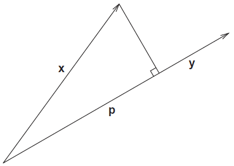

Title: Notes on Linear Regression
Date: December 5, 2016

Overview
--------
For linear systems $G$ is a matrix,
$$
G(m) = G_{m \times n} ~ m_{n \times 1} = d_{m \times 1}
$$

If $\text{rank}(G) = n$, then $G$ has full column rank and will be assumed in general for linear regression. Usually $G ~ m \neq d$ exactly because $d$ will contain some noise. To overcome this instead of solving for $m$ directly, we look for a minimization of a measure of the residual vector $r$
$$
r = d - G~m
$$
A common measure to minimize $r$ is the $L_2$ norm, this is the __least squares solution__. It is statistically most likely if errors are normally distributed. To derive the $L_2$ solution $m_{L_2}$, we need the projection vector $\text{proj}_y (x)$.
$$
||x-y||_2^2 = ||x||_2^2 + ||y||_2^2 - 2 ||x||_2 ||y||_2 \cos{\theta} \\
(x-y)^T (x-y) = x^T x + y^T y - 2 ||x||_2 ||y||_2 \cos{\theta} \\
x^T x - 2x^T y + y^T y = x^T x + y^T y - 2 ||x||_2 ||y||_2 \cos{\theta} \\
-2x^T y = -2 ||x||_2 ||y||_2 \cos{\theta} \\
x^T y = ||x||_2 ||y||_2 \cos{\theta}
$$

This is used to get the _projection_ $p$ of $x$ onto $y$ as shown below.

$$
\cos{\theta} = \frac{||p||_2}{||x||_2} \\
x^T y = ||x||_2 ||y||_2 \frac{||p||_2}{||x||_2} \\
||p||_2 = \frac{x^T y}{y^T y}
$$

Since $p$ is in the direction of $y$, we can then define the projection vector $\text{prop}_y (x)$ as

$$
\text{proj}_y (x) = ||p||_2 y = \frac{x^T y}{y^T y} y
$$

Now we want to find the best $m_\text{ls}$ which minimizes $||d - G ~ m_\text{ls} ||_2^2$ where $m_\text{ls}$ is the least squares solution. The closest we can get to $d$ will be the projection of $d$ onto the range of $G$, $R(G)$, and will be our least squares solution.
$$
G ~ m_\text{ls} = \text{proj}_{R(G)} (d)
$$
Since the component of $d$ not in $R(G)$, $G ~ m_\text{ls} - d$ is perp to $R(G)$, each column of $G$ is orthogonal to it
$$
G^T (G ~ m_\text{ls} - d) = 0 \\
G^T G ~ m_\text{ls} - G^T d = 0 \\
(G^T G) m_\text{ls} = G^T d
$$
If the columns of $G$ are linearly independent $m_\text{ls}$ has one unique solution and minimizes $||G ~ m - d||_2^2$
$$
m_\text{ls} = (G^T G)^{-1} G^T d
$$

Maximum Likelihood and Least Squares
------------------------------------

To account for errors in least squares solutions, a derivation based on joint probability distributions can be used. __Maximum Likelihood Estimation__ (MLE) considers each data $d$ observable, their statistical properties, a model $G$, and determines the most likely $m$.

For each ith component of $d$, there exists a probability distribution for $d_i$, $f_i (d_i | m)$. For all components of $d$ the pdf is the joint distribution
$$
f(d| m) = f_1 (d_1 | m) ~ f_2 (d_2 | m) ~ \dots f_m (d_m | m) 
$$
This is also known as the likelihood $L$, $L(m | d) = f(d | m)$, considered a function of $m$ given $d$. MLE selects $m$ to maximize $L(m | d)$.

In discrete linear inverse problems with independent normally distributed data errors, the MLE solution is equivalent to the Least Squares solution.

For data observation $i$ with $\sigma_i$ standard deviation
$$
f_i (d_i | m) = \frac{1}{\sigma_i \sqrt{2 \pi}} e^{-1/2 (d_i - (G~m)_i)^2 / \sigma_i^2}
$$
Then $L(m | d) = f(d | m)$,
$$
L (m | d) = \frac{1}{(2 \pi)^(m/2) \prod_{i=1}^{m} \sigma_i} \prod_{i=1}^m e^{-1/2 (d_i - (G~m)_i)^2 / \sigma_i^2}
$$
The constant doesn't affect maximizing $L(m|d)$, and can be ignored. Additionally we can safely maximize the log of likelihood instead
$$
\text{max} \log \prod_{i=1}^m e^{-1/2 (d_i - (G~m)_i)^2 / \sigma_i^2} = \text{max} (-1/2 \sum_{i=1}^k (d_i - (G~m)_i)^2 / \sigma_i^2)
$$
Dropping the $1/2$ and treating it as a minimization problem by changing signs, to maximize the likelihood we look for an $m$ such that
$$
\text{min} \sum_{i=1}^k \frac{(d_i - (G~m)_i)^2}{\sigma_i^2}
$$
By scaling with $W = \text{diag}(1/\sigma_1, 1/\sigma_2, \dots , 1/\sigma_m)$, the likelihood function can be expressed as the least squares solution
$$
G_W = W~G \quad d_W = W~d \\
\sum_{i=1}^k \frac{(d_i - (G~m)_i)^2}{\sigma_i^2} = ||d_W - G_W ~ m_{L_2} ||_2^2
$$
Which as shown previously has the $L_2$ solution 
$$
m_{L_2} = (G_W^T G_W)^{-1} G_W^T d_W
$$